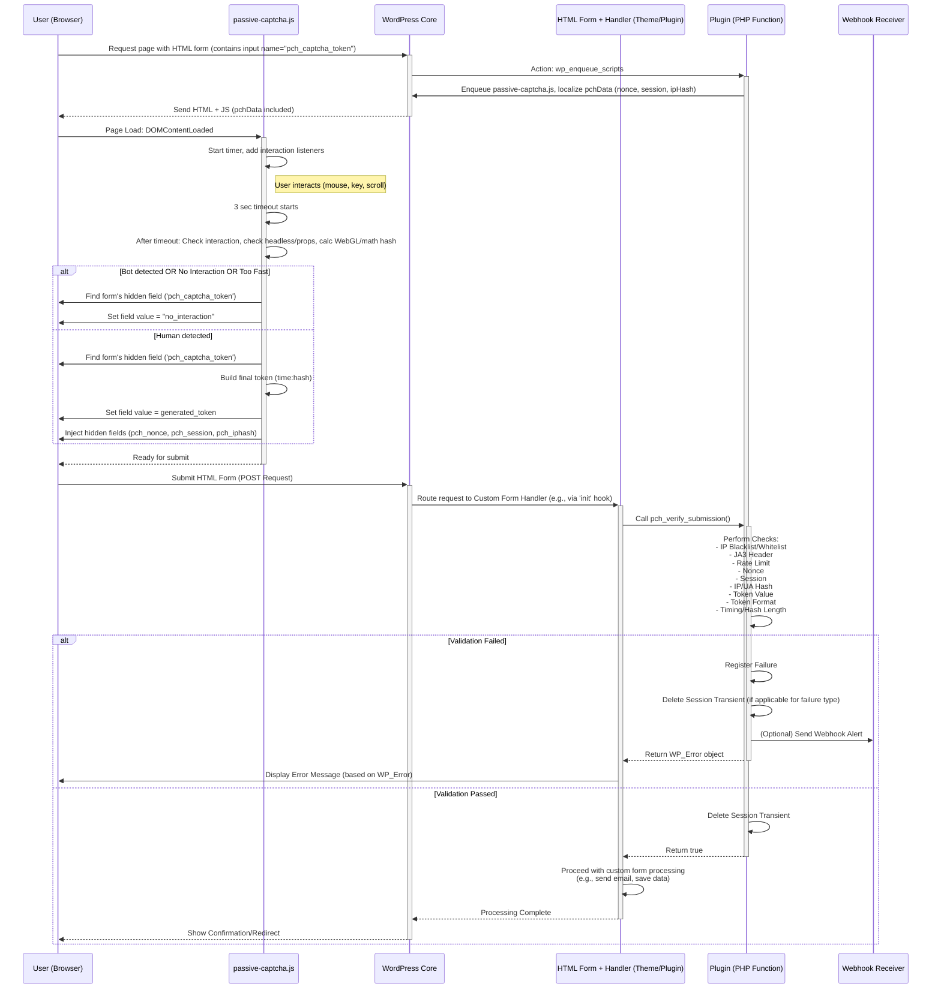

# Sequence Diagram

```mermaid
sequenceDiagram
    participant B as User (Browser)
    participant JS as passive-captcha.js
    participant WP as WordPress Core
    participant FORM as HTML Form + Handler (Theme/Plugin)
    participant PCH as Plugin (PHP Function)
    participant WH as Webhook Receiver

    B->>+WP: Request page with HTML form (contains input name="pch_captcha_token")
    WP->>+PCH: Action: wp_enqueue_scripts
    PCH->>WP: Enqueue passive-captcha.js, localize pchData (nonce, session, ipHash)
    WP-->>-B: Send HTML + JS (pchData included)

    B->>+JS: Page Load: DOMContentLoaded
    JS->>JS: Start timer, add interaction listeners
    Note right of JS: User interacts (mouse, key, scroll)
    JS->>JS: 3 sec timeout starts
    JS->>JS: After timeout: Check interaction, check headless/props, calc WebGL/math hash
    alt Bot detected OR No Interaction OR Too Fast
        JS->>B: Find form's hidden field ('pch_captcha_token')
        JS->>B: Set field value = "no_interaction"
    else Human detected
        JS->>B: Find form's hidden field ('pch_captcha_token')
        JS->>JS: Build final token (time:hash)
        JS->>B: Set field value = generated_token
        JS->>B: Inject hidden fields (pch_nonce, pch_session, pch_iphash)
    end
    JS-->>-B: Ready for submit

    B->>+WP: Submit HTML Form (POST Request)
    WP->>+FORM: Route request to Custom Form Handler (e.g., via 'init' hook)
    FORM->>+PCH: Call pch_verify_submission()
    PCH->>PCH: Perform Checks: <br/> - IP Blacklist/Whitelist <br/> - JA3 Header <br/> - Rate Limit <br/> - Nonce <br/> - Session <br/> - IP/UA Hash <br/> - Token Value <br/> - Token Format <br/> - Timing/Hash Length
    alt Validation Failed
        PCH->>PCH: Register Failure
        PCH->>PCH: Delete Session Transient (if applicable for failure type)
        PCH->>WH: (Optional) Send Webhook Alert
        PCH-->>-FORM: Return WP_Error object
        FORM->>B: Display Error Message (based on WP_Error)
    else Validation Passed
        PCH->>PCH: Delete Session Transient
        PCH-->>-FORM: Return true
        FORM->>FORM: Proceed with custom form processing <br/> (e.g., send email, save data)
        FORM-->>-WP: Processing Complete
        WP-->>-B: Show Confirmation/Redirect
    end
```
